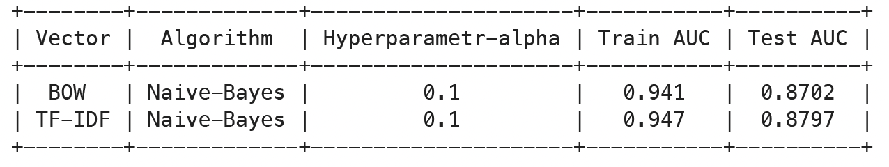

# Sentiment Analysis of Food Reviews Using Score Feature

## Primary Features

- **Id:** Unique identifier for each review
- **ProductId:** Unique identifier for the product
- **UserId:** Unique identifier for the user
- **ProfileName:** Profile name of the user
- **HelpfulnessNumerator:** Number of users who found the review helpful
- **HelpfulnessDenominator:** Number of users who indicated whether they found the review helpful or not
- **Score:** Rating between 1 and 5
- **Time:** Timestamp for the review
- **Summary:** Brief summary of the review
- **Text:** Text of the review


## Table of Contents

- [Introduction](#introduction)
- [Project Structure](#project-structure)
- [Installation](#installation)
- [Demo](#usage)
- [Data](#data)
- [Model](#model)
- [Results](#results)


## Introduction
Customer reviews are a valuable resource for businesses aiming to improve their
products and services. Sentiment analysis helps in understanding the emotional tone
behind customer reviews. This project leverages the Score feature in the provided
dataset to categorise reviews directly into positive, negative, or neutral sentiments.
The main objective is to preprocess the review text, create target labels if required
and build a sentiment analysis model. The insights obtained will help businesses
enhance their products and services based on customer feedback
If the rating is 4 or 5 the it is consider as Positive Sentiment and if rating is 1 or 2
then Negitive Sentiment and if the rating is 3 then we consider it as neutral but will
not consider it because we need to find the Polarity(Positive/Negitive) of the review

## Project Structure


### Directory and File Descriptions:


- **AMAZON_FINE_FOOD_REVIEWS/**: Root directory of the project.
  
  - **Data_cleaning+EDA+Preprocessing+vectorizarion+/**: Contains scripts and notebooks related to data cleaning, exploratory data analysis (EDA), preprocessing, and vectorization.
    - **Data_Preprocessing_and_EDA.ipynb**: Notebook for data preprocessing and exploratory data analysis.

  - **Models/**: Directory for storing different machine learning model notebooks.
    - **Naive_bayes.ipynb**: Notebook implementing Naive Bayes model.
    - **logestic_regression.ipynb**: Notebook implementing Logistic Regression model.
    - **Decision_tree.ipynb**: Notebook implementing Decision Tree model.
    - **Random_Forest.ipynb**: Notebook implementing Random Forest model.
    - **XGBoost.ipynb**: Notebook implementing XGBoost model.

  - **static/**: Directory for static files used by the web application.
    - **image/**: Directory for storing images.
    - **style/**: Directory for storing stylesheets (CSS).

  - **templates/**: Directory for HTML templates.
    - **index.html**: Main HTML template for the web application.

  - **app.py**: Main Python script to run the web application.

  - **final_dataset.xlsx**: Final dataset used for the analysis and modeling.

  - **model.pkl**: Serialized model file.

  - **vectorizer.pkl**: Serialized vectorizer file.

  - **procfile**: Configuration file for deployment on platforms like Heroku.

  - **requirements.txt**: List of dependencies required to run the project.

  - **.gitignore**: Specifies files and directories to be ignored by git.

## Installation

```bash
  conda create -p venv
```

```bash
  pip install -r requirements.txt
```

## Demo


## Tech Stack

<p align="center">
    
    
    
    
    
    
    
</p>


## Badges


## Model

- **Naive Bayes** 

## Naive Bayes

Naive Bayes is a probabilistic classifier based on Bayes' Theorem with an assumption of independence between features. It is particularly useful for text classification problems.

### Types of Naive Bayes

- **Gaussian Naive Bayes**: Assumes features follow a normal distribution; used for continuous data.
- **Multinomial Naive Bayes**: Used for discrete data, such as word counts in text classification.
- **Bernoulli Naive Bayes**: Used for binary/Boolean features.

### How It Works

Naive Bayes classifiers are based on Bayes' Theorem:


where:
- P(c|x) is the posterior probability of class (c, target) given predictor (x, attributes).
- P(c) is the prior probability of class.
- P(x|c) is the likelihood which is the probability of the predictor given class.
- P(x) is the prior probability of the predictor.


<h1>Logistic Regression</h1>

 <p>Logistic Regression is a statistical method used for binary classification problems. It estimates the probability that a given input belongs to a specific class.</p>

<h2>Key Concepts</h2>
    <ul>
<li><strong>Logistic Function:</strong> 
        The logistic function, or sigmoid function, is  used to model probabilities. It is defined as:
            <p><code>σ(z) = 1 / (1 + e<sup>-z</sup>)</code></p>
            where <code>z</code>
            is a linear combination of input features.</li>
<li> <strong>Model Formula:</strong> 
        The probability <code>p</code> of the positive class is given by:
            <p><code>p = σ(w<sup>T</sup> x + b)</code></p>
            where <code>σ</code> is the sigmoid function, <code>w</code> is the vector of weights, <code>x</code> is the vector of input features, and <code>b</code> is the bias term.
        </li>

<li><strong>Decision Boundary:</strong> The decision boundary is where the model predicts a probability of 0.5:
            <p><code>w<sup>T</sup> x + b = 0</code></p></li>

<li><strong>Cost Function:</strong> Logistic Regression uses the logistic loss (or binary cross-entropy loss) to measure prediction accuracy:
            <p><code>J(w, b) = -1/m * Σ [ y<sup>(i)</sup> log(h(x<sup>(i)</sup>)) + (1 - y<sup>(i)</sup>) log(1 - h(x<sup>(i)</sup>)) ]</code></p>
            where <code>h(x<sup>(i)</sup>) = σ(w<sup>T</sup> x<sup>(i)</sup> + b)</code> is the predicted probability, and <code>y<sup>(i)</sup></code> is the true label.</li>
    </ul>


 <p>Logistic Regression is a foundational algorithm in machine learning, ideal for binary classification tasks.</p>


## Decision Tree

A Decision Tree is a supervised learning algorithm used for both classification and regression tasks. It models decisions and their possible consequences using a tree-like graph.

### Key Concepts

- **Tree Structure**: The Decision Tree consists of nodes, branches, and leaves.
  - **Root Node**: The top node of the tree, representing the entire dataset.
  - **Decision Nodes**: Nodes where the data is split based on feature values.
  - **Leaf Nodes**: Terminal nodes representing the final outcome or prediction.

- **Splitting**: The process of dividing a node into two or more sub-nodes. Splitting is done based on feature values to maximize some criterion, such as Gini impurity or Information Gain for classification, and variance reduction for regression.

- **Pruning**: The process of removing nodes from the tree to avoid overfitting and improve generalization. Pruning can be done by setting limits on tree depth or by using methods like cost complexity pruning.

- **Decision Rules**: The rules derived from the paths from the root to the leaves. Each path represents a sequence of decisions leading to a prediction.


## Random Forest

Random Forest is an ensemble learning method used for both classification and regression tasks. It builds multiple decision trees and merges their results to improve accuracy and control over-fitting.

### Key Concepts

- **Ensemble Method**: Random Forest is an ensemble of decision trees. Each tree is trained on a random subset of the training data, and predictions are made by aggregating the predictions from all trees.

- **Bootstrap Aggregating (Bagging)**: The training data for each tree is sampled with replacement, meaning that each tree is trained on a different subset of the data. This helps to reduce variance and prevent overfitting.

- **Feature Randomness**: During the training of each decision tree, only a random subset of features is considered for splitting at each node. This introduces diversity among the trees and improves the overall performance of the forest.

- **Aggregation**:
  - **Classification**: The class predicted by the majority of trees is chosen as the final prediction.
  - **Regression**: The average of all tree predictions is used as the final prediction.


## XGBoost

XGBoost (Extreme Gradient Boosting) is a highly efficient and scalable implementation of gradient boosting. It is widely used in machine learning competitions and real-world applications for its performance and accuracy.

### Key Concepts

- **Gradient Boosting**: XGBoost builds an ensemble of decision trees in a sequential manner, where each new tree corrects the errors made by the previous trees. This is done by optimizing a loss function through gradient descent.

- **Regularization**: XGBoost incorporates L1 (Lasso) and L2 (Ridge) regularization to control model complexity and prevent overfitting. This helps in improving generalization and performance on unseen data.

- **Tree Pruning**: Unlike traditional gradient boosting, XGBoost uses a depth-first approach to grow trees and prunes them based on a specified complexity parameter, which helps to manage the tree depth more effectively.

- **Parallel Processing**: XGBoost supports parallel processing, making it highly efficient and scalable. It uses hardware resources effectively to speed up the training process.

- **Handling Missing Values**: XGBoost can handle missing values internally by learning the best way to split the data when encountering missing values.

- **Feature Importance**: XGBoost provides tools for evaluating feature importance, which helps in understanding which features contribute most to the model’s predictions.


## Results
**XGBoost⚡️**: shows best performance with 0.89 Test AUC 